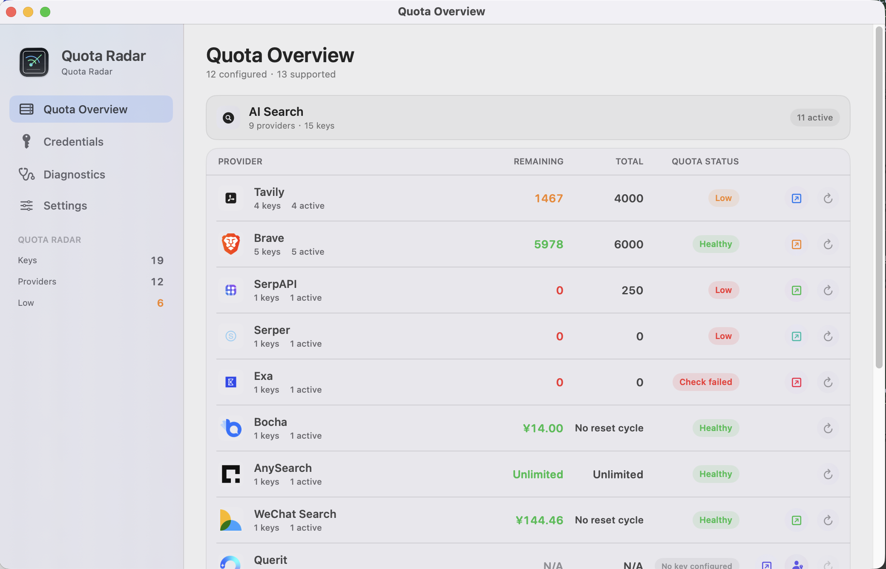
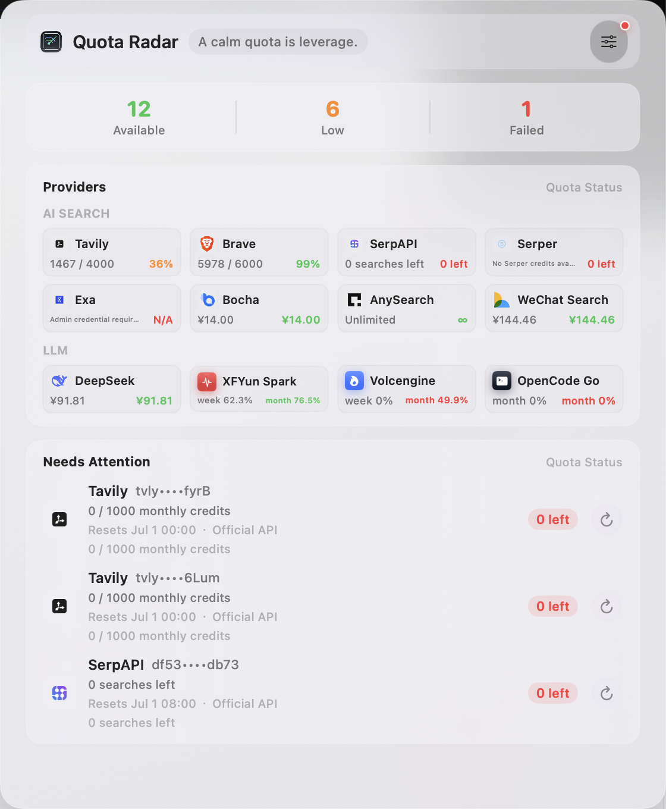

# Quota Radar

<p align="right">
  Language:
  <a href="./README.md">简体中文</a> |
  <strong>English</strong>
</p>

Quota Radar is a macOS menu bar app for monitoring search API and LLM coding-plan quota status without repeatedly logging in to provider dashboards.

The stable Quota Radar app currently supports macOS, with macOS 14.0 as the minimum supported version. A cross-platform Tauri desktop app is being developed under `apps/desktop-tauri` for future macOS / Windows / Linux support; it is a preview development track, not a replacement for the Swift macOS release yet.

Naming convention: the GitHub repository, Swift package, and DMG use `QuotaRadar`; the macOS app display name and app bundle use `Quota Radar`.


Current version: `v0.3.3`.

See [TODO / Roadmap](./TODO.en.md) for the next development plan.

For credential type, usage source, and automatic-refresh constraints by provider, see the [Provider Capability Matrix](./docs/provider-capabilities.en.md).

## What's New In v0.3.3

- Added an in-app GitHub Release update entry point: the lower-left main-window footer now shows the current version, update status, and a manual check button.
- Added automatic update checks after launch. Automatic checks only detect new versions and show release notes; they do not silently download or replace the app.
- When a new version is available, Quota Radar shows release notes first. It downloads `QuotaRadar.dmg`, replaces `/Applications/Quota Radar.app`, clears quarantine, and relaunches only after you click `Download and Install`.
- Update checks reuse the app's network proxy settings. If the unauthenticated GitHub API is rate-limited, Quota Radar falls back to the GitHub latest-release redirect to resolve the version and download URL.
- Refreshed Chinese and English README menu bar screenshots and documentation so screenshots, Quickstart, and Roadmap match the current risk-first menu bar popover.

## Screenshots

<p align="center">
  
</p>

<p align="center">
  <em>The main window summarizes key quota, credential pool, critical time, and quota status by provider, showing configured providers only. Screenshots are captured from the running app, with credentials masked by Quota Radar.</em>
</p>

<p align="center">
  
</p>

<p align="center">
  <em>The menu bar popover keeps the most important quota signals visible without interrupting your current work.</em>
</p>

## Features

- Frosted-glass menu bar popover focused on today's risk, expiring credentials, and items needing attention.
- Supports multiple providers and credentials, with credentials sorted by remaining quota inside each provider.
- `Quota Overview`, `Credentials`, and `Diagnostics` show only providers with saved credentials, avoiding empty provider placeholders.
- Supports API keys and web login authorizations.
- Imports supported credentials from `.env` or `~/.claude/settings.json`.
- Supports launch at login, configurable automatic refresh intervals, and fully disabling automatic refresh.
- Checks GitHub Releases for new versions, with version and update status in the lower-left sidebar footer. New versions are not downloaded silently; Quota Radar downloads the latest DMG, shows release notes, and replaces the installed app only after confirmation.
- Stores secrets in `~/Library/Application Support/QuotaRadar/secrets.json` with `0600` permissions; preferences store metadata only.

## Supported Providers

### AI Search

| Provider | Notes |
| --- | --- |
| Tavily | Monthly credits, normally reset on day 1 |
| Brave Search | Quota from search response headers |
| SerpAPI | Account API |
| Serper | Account API returns balance and rateLimit; reset/end times are not exposed |
| Exa | Admin API usage cost; search keys do not expose usage directly |
| Bocha | CNY balance API |
| AnySearch | Treated as free unlimited usage |
| Querit | Web login authorization; monthly usage is readable, but plan limit/reset/end are not exposed |
| WeChat Search | Remaining CNY account balance |

### LLM / Plans

| Provider | Credential Type |
| --- | --- |
| Claude | Subscription web login authorization; optional `ANTHROPIC_API_KEY` storage for copying; five-hour/weekly refresh, reset times, and subscription-cycle end date are wired. API Usage remains hidden |
| Codex | Subscription web login authorization; optional `OPENAI_API_KEY` storage for copying; Codex Cloud five-hour/weekly refresh and plan expiry are wired |
| Kimi | Subscription web login authorization; optional `KIMI_API_KEY` storage for copying; Kimi BillingService usage and MembershipService subscription balance are wired. Five-hour/weekly windows are shown, and monthly subscription balance is shown when exposed |
| DeepSeek | API key, shown as CNY account balance |
| XFYun Spark Coding Plan | Web login authorization, 5-hour/weekly/monthly request-count windows implemented |
| Volcengine Coding Plan | Web login authorization, quota cycles implemented |
| OpenCode Go | Subscription web login authorization; optional `OPENCODE_GO_API_KEY` storage for copying |
| Aliyun Coding Plan | Web login authorization, subscription-state checks implemented; if the dashboard exposes 5-hour/weekly/monthly request counts, Quota Radar renders them with the shared model |
| Tencent Cloud Coding Plan | Web login authorization, dashboard `cgi/capi?cmd=DescribePkg&serviceType=hunyuan` subscription/request-count cycles implemented |

Kimi uses web login authorization, not a model invocation API key. Quota Radar calls `BillingService/GetUsages` for Kimi Code five-hour/weekly windows, remaining counts, and reset times, and calls `GetSubscription` for subscription balance, billing cycle, or balance expiry. If the subscription endpoint only returns membership state without quota fields, Quota Radar shows "Usable · quota unknown" instead of inventing monthly quota. Kimi Code's official OAuth `/coding/v1/usages` path is tracked on the roadmap; the current main flow still uses one web login authorization to cover usage plus subscription balance.

XFYun Spark Token Plan currently looks like seat/count quota, Aliyun Token Plan is expected to be credits-based, Tencent Cloud Token Plan keeps an official API parser but lacks a real user key sample, and Volcengine Token Plan still needs a stable usage endpoint. These Token Plan integrations remain modeled as code extension points, but they are hidden from the main UI and credential imports until usable quota fields and real credential samples are confirmed. See the [Provider Capability Matrix](./docs/provider-capabilities.en.md) for browser/API-verified `quota`, `resetAt`, and `planEndsAt` conclusions.

## Requirements

- macOS 14.0 or newer
- Xcode or Command Line Tools
- Swift 5.9

## Build And Install

### Stable macOS App

```bash
./install.sh --bundle-only --rebuild
open 'build/Quota Radar.app'
```

Install into `/Applications`:

```bash
./install.sh
```

`./install.sh` reuses the existing `build/Quota Radar.app` by default. Use `--rebuild` when you need a fresh build.

See [Quickstart](./QUICKSTART.en.md) for the full flow.

### Tauri Cross-Platform Preview

The Tauri app is the cross-platform implementation track for the current macOS UI, credential model, and provider refresh logic. It now has source safety checks, frontend tests, Rust provider tests, and a three-platform CI preview build. Signed installers, updater artifacts, and formal distribution remain follow-up work. See [Tauri Desktop Release](./docs/desktop-tauri-release.md) for packaging and update boundaries.

```bash
bash scripts/check_tauri_sources.sh
cd apps/desktop-tauri
pnpm install
pnpm test -- --run
pnpm typecheck
cargo test --manifest-path src-tauri/Cargo.toml
pnpm tauri build --no-bundle --ci
```

`--no-bundle` validates that the Tauri desktop app compiles without producing Windows/Linux installers. Packaging rules and the unsigned update boundary are documented in the release note above.

## DMG Packaging And Gatekeeper

Local, self-use, or no-fee unsigned DMG:

```bash
scripts/package_dmg.sh --rebuild
open build/QuotaRadar.dmg
```

Manual GitHub Release upload:

```bash
gh release create v0.3.3 build/QuotaRadar.dmg \
  --title "Quota Radar v0.3.3" \
  --notes "Unsigned DMG for trusted users. macOS may require removing quarantine on first launch."
```

You can also push a tag and let GitHub Actions build the unsigned DMG and upload it to the Release:

```bash
git tag v0.3.3
git push origin v0.3.3
```

An unsigned DMG does not require Apple Developer Program membership, but macOS Gatekeeper may block the downloaded app. Install it only if you trust this source repository and release. If macOS says the app is damaged or cannot be opened, move the app into `/Applications` and run:

```bash
xattr -dr com.apple.quarantine '/Applications/Quota Radar.app'
open '/Applications/Quota Radar.app'
```

For broader distribution to other Macs, the reliable way to avoid "damaged app" Gatekeeper warnings is still Developer ID signing plus Apple notarization:

```bash
DEVELOPER_ID_APPLICATION="Developer ID Application: Your Name (TEAMID)" \
NOTARYTOOL_PROFILE="notary-profile" \
scripts/package_dmg.sh --rebuild --notarize
```

Without Developer ID signing and notarization, the DMG is suitable only for local, source-auditable GitHub, or otherwise trusted environments; downloaded copies may still be blocked by Gatekeeper.

## Usage

1. Click the menu bar quota-radar icon to open the quota panel.
2. Open `Credentials` to add credentials or import from `.env`.
3. Use API keys for normal providers. Exa requires a Team Management service key plus the target API key id. Querit, Claude, Codex, Kimi, XFYun Spark Coding Plan, Volcengine Coding Plan, OpenCode Go, and Aliyun/Tencent Cloud Coding Plan can store both a copyable API key and web login authorization. Quota monitoring still uses web login authorization; API keys are only for management and copying.
4. Click a provider-level refresh button to update that provider.

Use `Settings` to switch language, tune menu bar transparency, configure launch at login, enable automatic update checks, set the network proxy, and choose automatic refresh intervals. Automatic refresh can be disabled; providers such as Brave that consume a real search request are skipped by default and only join the longer `Search Refresh` cadence when explicitly enabled.

The lower-left corner of the main window shows the installed version and update status. When `Automatically Check for Updates` is enabled, Quota Radar only checks GitHub Releases in the background. If a new version is available, it shows release notes, but it does not silently download or replace the app. Only after you click `Download and Install` does it download `QuotaRadar.dmg`, replace `/Applications/Quota Radar.app`, clear quarantine, and relaunch. This still follows the unsigned GitHub Release trust model, so use it only when you trust this repository and release.

To keep frequently used providers near the top, enable `Custom Provider Order` in `Settings`, click `Configure`, then drag provider rows. The order applies to all three main pages and the menu bar popover; `AI Search` and `LLM` remain grouped.

`Quota Overview`, `Credentials`, and `Diagnostics` show only providers that already have saved credentials. Providers that have not been configured do not appear as empty placeholders; add them through `Add Credential`.

## `.env` Import

Supported variable names include:

```env
TAVILY_API_KEY=...
BRAVE_API_KEY=...
SERPAPI_API_KEY=...
SERPER_API_KEY=...
EXA_API_KEY=...
EXA_ADMIN_CREDENTIAL='{"serviceKey":"<exa-admin-service-key>","apiKeyId":"<target-api-key-id>","days":30}'
BOCHA_API_KEY=...
ANYSEARCH_API_KEY=...
QUERIT_API_KEY=...
QUERIT_COOKIE=...
WX_MP_SEARCH_API_KEY=...
WECHAT_API_KEY=...
DEEPSEEK_API_KEY=...
XFYUN_CODING_PLAN_COOKIE=...
VOLCENGINE_CODING_PLAN_COOKIE=...
OPENCODE_GO_COOKIE=...
ALIYUN_CODING_PLAN_API_KEY=...
TENCENT_CLOUD_CODING_PLAN_API_KEY=...
```

For web-login authorization providers, prefer the in-app re-authentication flow. You can also paste a browser-copied cURL command in the credential form so Quota Radar can extract the required login authorization fields. Never commit real authorization data to Git.

Claude / Codex are split into subscription quota and API Usage. The main UI currently hides Claude/Codex API Usage to avoid dead placeholders when no admin usage monitor is configured; Claude/Codex subscription quota uses web login authorization. The credential UI can also save `ANTHROPIC_API_KEY`, `OPENAI_API_KEY`, and `KIMI_API_KEY` alongside Claude/Codex/Kimi subscription authorization, but those API keys are only for copying and management, not subscription quota checks. Claude Subscription first discovers the active organization through `/api/organizations`, then calls `/api/organizations/{org_uuid}/usage` to parse `five_hour` and `seven_day` remaining percentages plus reset times, and uses `/api/organizations/{org_uuid}/subscription_details` `next_charge_at` or `next_charge_date` as the subscription-cycle end date. The compact UI does not show model-specific windows yet, and Anthropic API / prepaid credits remain separate. Codex Cloud first resolves a ChatGPT session access token through `/api/auth/session`, then calls `/backend-api/wham/usage` for five-hour/weekly windows and reset times, and uses `/backend-api/subscriptions?account_id=...` `active_until` for plan expiry. The current usage response does not expose a monthly window.

Exa search API keys cannot query usage. To monitor Exa, use a Team Management service key plus the target API key id; Quota Radar displays the selected key's usage cost for the configured period.
Querit `QUERIT_API_KEY` values can be stored and copied as API keys, but they cannot query dashboard account usage. Quota monitoring still requires web login authorization. The current Querit account endpoint returns monthly usage, but not the plan limit, reset time, or end date.

```env
VOLCENGINE_CODING_PLAN_COOKIE='{"cookie":"<cookie-header-value>","csrfToken":"<csrf-token>","projectName":"default"}'
OPENCODE_GO_COOKIE='{"cookie":"<cookie-header-value>","workspaceID":"wrk_example","serverID":"server-example","serverInstance":"server-fn:11"}'
```

Aliyun Coding Plan and Tencent Cloud Coding Plan business keys can be stored and shown, but quota monitoring uses web login authorizations. Aliyun Coding Plan now queries dashboard subscription instances through `codingPlan.queryCodingPlanInstanceInfoV2`; no subscription is shown as "No subscribed plan", while subscribed packages expose five-hour/weekly/monthly request-count windows, window reset times, and the package end date. Quota Radar renders those remaining/total counts with the same model used by XFYun Spark and Tencent Cloud. Tencent Cloud Coding Plan uses dashboard `cgi/capi?cmd=DescribePkg&serviceType=hunyuan`; subscribed packages can expose request counts, quota-window reset times, and the package end time. XFYun Spark Token Plan, Aliyun Token Plan, and Tencent Cloud Token Plan still need non-empty package or real-key samples before quota fields can be trusted; Volcengine Token Plan remains hidden until a stable usage endpoint is confirmed.

## Claude Code Import

On first launch, if no credentials are configured, Quota Radar reads the `env` section from `~/.claude/settings.json` and imports supported variables.

Imported secret values go into Quota Radar's local secret file; source code and preferences do not store real keys.

## Architecture

```text
QuotaRadar/
├── Models/
│   ├── APIKey.swift
│   ├── AppAppearance.swift
│   ├── AppLanguage.swift
│   └── QuotaMonitor.swift
├── Services/
│   ├── APIKeyStore.swift
│   ├── FileSecretStore.swift
│   ├── QuotaService.swift
│   ├── EnvImporter.swift
│   └── DashboardReauth.swift
├── Views/
│   ├── Components.swift
│   ├── MenuContentView.swift
│   └── SettingsView.swift
├── AppDelegate.swift
└── QuotaRadarApp.swift
```

## Adding A Provider

Adding a provider usually requires changes in:

- `QuotaRadar/Models/APIKey.swift`: provider case, category, icon, credential type, dashboard URL, reset summary.
- `QuotaRadar/Services/EnvImporter.swift`: environment-variable detection.
- `QuotaRadar/Services/QuotaService.swift`: quota check and parser.
- `QuotaRadar/Services/CurlCredentialParser.swift`: cURL parsing for web-login providers.
- `QuotaRadar/Assets.xcassets/ProviderIcons/`: provider icon assets.
- `Tests/run_behavior_tests.sh`: behavior and parser coverage.

## Tests

```bash
bash Tests/run_behavior_tests.sh
```

The script runs source safety checks, provider icon checks, importer/parser behavior tests, SwiftPM build, and bundle creation.

## Privacy

- No real API keys, cookies, or tokens are embedded.
- Real credentials are stored only under the user's local `Application Support/QuotaRadar`.
- All requests go directly to the provider; there is no proxy server.

## License

MIT
