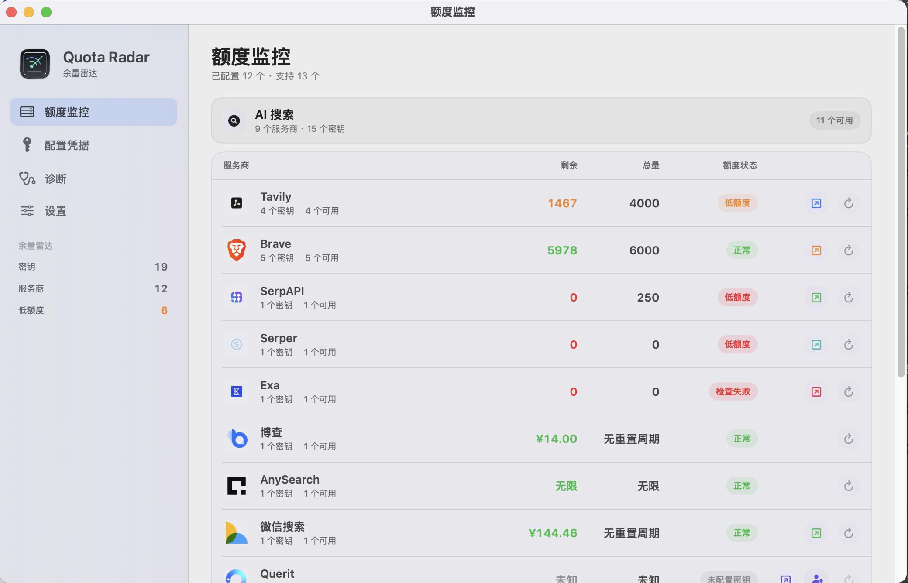
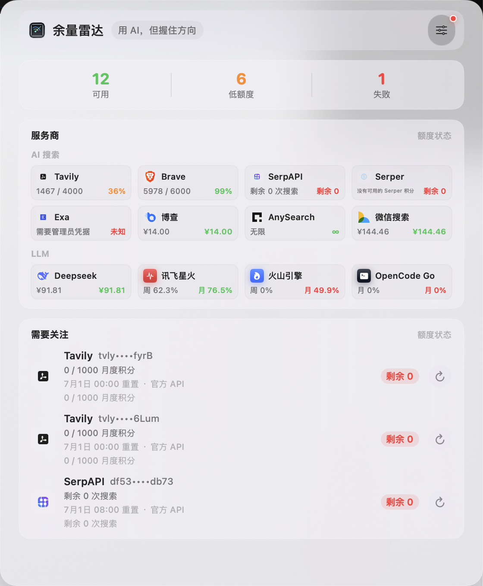

# Quota Radar

<p align="right">
  语言：
  <strong>简体中文</strong> |
  <a href="./README.en.md">English</a>
</p>

Quota Radar 是一个 macOS 状态栏应用，用来观察搜索 API 与 LLM coding plan 的额度状态，减少反复登录各家后台查询额度的成本。

当前支持 macOS，最低版本为 macOS 14.0。

命名约定：GitHub 仓库、Swift package 和 DMG 使用 `QuotaRadar`；macOS App 显示名和 bundle 名使用 `Quota Radar`。


当前版本：`v0.2.2`。

下一阶段计划见 [TODO / Roadmap](./TODO.md)。

## 界面预览

<p align="center">
  
</p>

<p align="center">
  <em>主窗口以 provider 为单位展示剩余额度、总量和健康状态；截图来自真实运行画面，密钥由应用自动打码。</em>
</p>

<p align="center">
  
</p>

<p align="center">
  <em>状态栏弹窗保留最重要的额度信号，适合随手查看而不打断当前工作。</em>
</p>

## 功能

- 状态栏磨砂玻璃弹窗，按 `AI Search` 和 `LLM` 分组展示额度。
- 支持多个 provider、多个凭据，并按 provider 内剩余额度排序。
- 支持 API Key、Admin Credential 与控制台会话 Cookie 三类凭据。
- 可从 `.env` 或 `~/.claude/settings.json` 导入支持的凭据。
- 支持开机自启动、自动刷新间隔配置，也可以完全关闭自动刷新。
- 真实凭据存储在 `~/Library/Application Support/QuotaRadar/secrets.json`，权限为 `0600`；偏好设置只保存 metadata。

## 支持的服务商

### AI Search

| Provider | 说明 |
| --- | --- |
| Tavily | 月度 credits，通常每月 1 日重置 |
| Brave Search | 搜索响应 header 额度 |
| SerpAPI | Account API |
| Serper | Account API |
| Exa | Admin API 查询已用成本；普通 search key 不直接暴露用量 |
| Bocha | 人民币余额 API |
| AnySearch | 当前按免费无限处理 |
| Querit | 控制台会话 Cookie |
| 微信搜索 | 账户剩余人民币金额 |

### LLM / Coding Plan

| Provider | 凭据类型 |
| --- | --- |
| DeepSeek | API Key，展示人民币账户余额 |
| 讯飞星火 | 控制台会话 Cookie |
| 火山引擎 | 控制台会话 Cookie |
| OpenCode Go | 控制台会话 Cookie |

## 要求

- macOS 14.0 或更高版本
- Xcode 或 Command Line Tools
- Swift 5.9

## 构建与安装

```bash
./install.sh --bundle-only --rebuild
open 'build/Quota Radar.app'
```

复制到 `/Applications`：

```bash
./install.sh
```

`./install.sh` 默认复用已有 `build/Quota Radar.app`，需要重新构建时使用 `--rebuild`。

更多步骤见 [快速启动](./QUICKSTART.md)。

## DMG 打包与 Gatekeeper

本机自用或不付费发布的未签名 DMG：

```bash
scripts/package_dmg.sh --rebuild
open build/QuotaRadar.dmg
```

手动发布到 GitHub Release：

```bash
gh release create v0.2.2 build/QuotaRadar.dmg \
  --title "Quota Radar v0.2.2" \
  --notes "Unsigned DMG for trusted users. macOS may require removing quarantine on first launch."
```

也可以直接推送 tag，仓库的 GitHub Actions 会自动构建未签名 DMG 并上传到 Release：

```bash
git tag v0.2.2
git push origin v0.2.2
```

未签名 DMG 不需要 Apple Developer Program，但从 GitHub 下载后可能被 macOS Gatekeeper 拦截。只在信任该源码和 release 的情况下安装；如果提示“App 已损坏”或“无法打开”，先把 app 拖到 `/Applications`，再执行：

```bash
xattr -dr com.apple.quarantine '/Applications/Quota Radar.app'
open '/Applications/Quota Radar.app'
```

如果要发给更广泛的 Mac 用户，避免出现“App 已损坏，无法打开”的可靠方式仍然是使用 Apple Developer ID 签名并完成 notarization：

```bash
DEVELOPER_ID_APPLICATION="Developer ID Application: Your Name (TEAMID)" \
NOTARYTOOL_PROFILE="notary-profile" \
scripts/package_dmg.sh --rebuild --notarize
```

没有 Developer ID 签名和公证的 DMG 只适合本机、GitHub 源码可审计或其他受信任环境使用；跨机器下载后仍可能被 Gatekeeper 拦截。

## 使用

1. 点击状态栏余量雷达图标打开额度面板。
2. 进入 `配置凭据`，添加凭据或从 `.env` 导入。
3. 普通服务商填写 API Key；Exa 填 Admin Credential；Querit、讯飞星火、火山引擎、OpenCode Go 填控制台会话 Cookie。
4. 点击单个 provider 的刷新按钮更新该 provider。

在 `设置` 页面可以切换语言、调节状态栏透明度、配置开机自启动和自动刷新间隔。自动刷新支持关闭；Brave 这类会消耗真实搜索请求的 provider 会跳过自动刷新。

## `.env` 导入

支持的变量名包括：

```env
TAVILY_API_KEY=...
BRAVE_API_KEY=...
SERPAPI_API_KEY=...
SERPER_API_KEY=...
EXA_API_KEY=...
EXA_ADMIN_CREDENTIAL='{"serviceKey":"<exa-admin-service-key>","apiKeyId":"<target-api-key-id>","days":30}'
BOCHA_API_KEY=...
ANYSEARCH_API_KEY=...
QUERIT_COOKIE=...
WX_MP_SEARCH_API_KEY=...
WECHAT_API_KEY=...
DEEPSEEK_API_KEY=...
XFYUN_CODING_PLAN_COOKIE=...
VOLCENGINE_CODING_PLAN_COOKIE=...
OPENCODE_GO_COOKIE=...
```

Dashboard session provider 请只粘贴 Cookie header value，或使用 JSON 占位结构。不要把真实 Cookie 提交到 Git。

Exa 的普通 search API key 不能查询用量。若要监控 Exa，请在 Team Management 里使用 Admin API service key 和目标 API key id，Quota Radar 会显示该 key 在指定周期内的已用成本。
Querit 请使用控制台会话 Cookie；普通 `QUERIT_API_KEY` 不能查询 dashboard account 用量。

```env
VOLCENGINE_CODING_PLAN_COOKIE='{"cookie":"<cookie-header-value>","csrfToken":"<csrf-token>","projectName":"default"}'
OPENCODE_GO_COOKIE='{"cookie":"<cookie-header-value>","workspaceID":"wrk_example","serverID":"server-example","serverInstance":"server-fn:11"}'
```

## Claude Code 初始化

首次启动且尚未配置凭据时，Quota Radar 会读取 `~/.claude/settings.json` 的 `env` 字段并导入支持的变量。

导入后的真实值进入 Quota Radar 的本地 secret 文件；源码和偏好设置不保存真实密钥。

## 架构

```text
QuotaRadar/
├── Models/
│   ├── APIKey.swift
│   ├── AppAppearance.swift
│   ├── AppLanguage.swift
│   └── QuotaMonitor.swift
├── Services/
│   ├── APIKeyStore.swift
│   ├── FileSecretStore.swift
│   ├── QuotaService.swift
│   ├── EnvImporter.swift
│   └── DashboardReauth.swift
├── Views/
│   ├── Components.swift
│   ├── MenuContentView.swift
│   └── SettingsView.swift
├── AppDelegate.swift
└── QuotaRadarApp.swift
```

## 新增 Provider

新增 provider 通常需要修改：

- `QuotaRadar/Models/APIKey.swift`: provider case、category、icon、credential type、dashboard URL、reset summary。
- `QuotaRadar/Services/EnvImporter.swift`: 环境变量识别。
- `QuotaRadar/Services/QuotaService.swift`: 额度检查和解析逻辑。
- `QuotaRadar/Assets.xcassets/ProviderIcons/`: provider 图标资源。
- `Tests/run_behavior_tests.sh`: 行为测试和 parser 覆盖。

## 测试

```bash
bash Tests/run_behavior_tests.sh
```

该脚本会做源码安全检查、图标资源检查、导入/解析行为测试、SwiftPM 编译和 bundle 构建。

## 隐私

- 不内置任何真实 API Key、Cookie 或 token。
- 真实凭据仅存储在用户本机 `Application Support/QuotaRadar`。
- 所有请求直接发送到对应 provider，没有中间服务器。

## License

MIT
